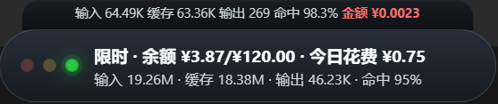
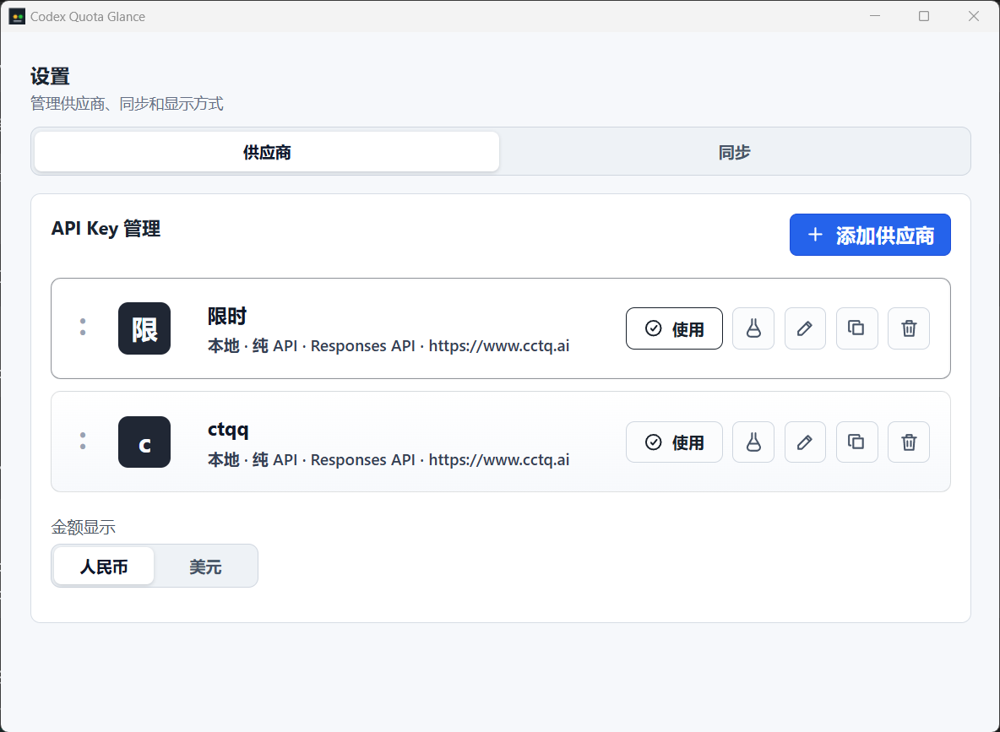

# QuotaPilot

> 基于 [Codex Quota Glance](https://github.com/akitten-cn/codex-quota-glance) 的 MIT 许可证衍生开发。原版权与许可证完整保留在 [LICENSE](LICENSE) 和 [NOTICE.md](NOTICE.md)。

QuotaPilot 是一个 Windows 桌面悬浮胶囊工具，用来查看 Codex 官方登录余量、Codex 本地会话 Token、New API 中转站余额、今日消耗和本地估算费用。

它的目标不是做一个浏览器页面，而是像 TrafficMonitor 一样长期停留在桌面边缘：平时只显示一个小胶囊，点击查看详情，右键打开设置，后台低频同步平台数据。

## 功能特性

- Electron 桌面悬浮胶囊，支持拖动位置并记忆。
- 任务栏托盘图标，右键可打开设置或退出。
- Codex 官方登录模式自动显示 5h / 7d 余量和刷新时间。
- Codex API 模式自动匹配当前 Codex 使用的 API key 对应供应商。
- New API 多供应商管理，每个 API key 可配置独立单价。
- Node 内建本地后端和 SQLite 本地缓存，不再依赖 Python/PowerShell 临时链路。
- 胶囊显示今日输入、缓存输入、输出、缓存命中率和今日花费。
- 消费弹窗读取本地 Codex 会话 Token，不依赖高频平台日志请求。
- 支持人民币 / 美元显示，本地可配置汇率。
- GitHub Releases 更新检测，在设置的“关于”页可手动检查新版本。

## 账号切换行为

- 官方登录模式只读取当前生效的 `%USERPROFILE%\.codex\auth.json`。
- 你在 Codex 中切换账号后，QuotaPilot 会在下一次刷新时读取新的活动登录并更新余量；无需把账号密码或 Token 导入应用。
- 它不会同时显示两个官方 Codex 账号，因为本机同一时刻只有一个活动 `auth.json`。多个 API Provider 则可在设置页独立保存和切换。

## 截图

### 悬浮胶囊



### 供应商设置



## 数据来源

### Codex 官方登录

官方登录时不计算金额，只显示余量和刷新时间。

主要来源：

- Codex app-server JSON-RPC `account/rateLimits/read`
- 本地 `.codex/sessions/**/*.jsonl` 中的 `token_count` 事件作为兜底

显示字段：

- 5h 剩余百分比和刷新时间
- 7d 剩余百分比和刷新时间
- 本地会话 Token 用量

### Codex API 模式

API 模式会读取本机 Codex 配置：

- `%USERPROFILE%\.codex\config.toml`
- `%USERPROFILE%\.codex\auth.json`

应用只使用当前 API key 的本地匹配指纹来选择已配置供应商，不会把完整 API key 暴露到前端状态中。

### New API 平台接口

当前适配 New API 站点：

```http
GET /api/user/self
Authorization: Bearer <SYSTEM_ACCESS_TOKEN>
New-Api-User: <USER_ID>
```

余额：

```text
balance = quota / 500000
usedAmount = used_quota / 500000
```

充值账单：

```http
GET /api/user/topup/self?p=1&page_size=100
Authorization: Bearer <SYSTEM_ACCESS_TOKEN>
New-Api-User: <USER_ID>
```

日志：

```http
GET /api/log/self?p=<PAGE>&page_size=100&type=0&token_name=&model_name=&start_timestamp=<START>&end_timestamp=<END>&group=&request_id=
Authorization: Bearer <SYSTEM_ACCESS_TOKEN>
New-Api-User: <USER_ID>
```

同步策略：

- 默认低频同步平台日志。
- 从 SQLite 最新日志时间减 300 秒开始增量拉取，避免漏数据。
- 遇到 429 进入退避。
- 胶囊的今日 Token 优先来自本地 Codex 会话事件和本地数据库，不高频请求平台。

## 本地费用估算

本地估算使用未命中缓存输入、缓存输入和输出分别计算：

```text
uncachedInputTokens = max(0, inputTokens - cachedInputTokens)

moneyCost =
  (uncachedInputTokens / 1_000_000 * inputPricePerMillion
  + cachedInputTokens / 1_000_000 * cachedInputPricePerMillion
  + outputTokens / 1_000_000 * outputPricePerMillion)
  * modelRatio
  * groupRatio
  * safetyMultiplier
```

本地估算永远只是估算。真实余额、充值账单和平台累计消耗优先来自平台接口。

## 安装和使用

### 下载绿色版

从 GitHub Releases 下载：

```text
QuotaPilot-<version>-win-x64.zip
```

解压后运行：

```text
QuotaPilot.exe
```

数据会保存到：

```text
%LocalAppData%\QuotaPilot\data\
```

绿色包不包含你的本地数据库、设置、API key 或日志。

### 从源码运行

需要：

- Node.js 24 或更高版本
- Windows 10/11

安装依赖：

```powershell
npm install
```

运行测试：

```powershell
npm test
```

开发浏览器预览：

```powershell
npm run dev
```

Electron 开发运行：

```powershell
npm run electron
```

打包 Windows 发布版：

```powershell
npm run dist:win
```

输出：

```text
dist-electron\QuotaPilot-<version>-win-x64.exe
dist-electron\QuotaPilot-<version>-win-x64-portable.exe
dist-electron\QuotaPilot-<version>-win-x64.zip
```

其中 `.exe` 安装包为 NSIS 安装版，`portable.exe` 为单文件便携版，`.zip` 为绿色版。

## CI/CD 和发布

仓库包含 GitHub Actions：

- `.github/workflows/ci.yml`
  - push / pull request 时运行密钥扫描、测试和前端构建。
- `.github/workflows/release.yml`
  - 推送 `v*` tag 时在 Windows runner 上打包 Electron 应用并创建 GitHub Release。

发布新版本：

```powershell
git tag v0.1.0
git push origin v0.1.0
```

GitHub Actions 会生成：

```text
QuotaPilot-<version>-win-x64.exe
QuotaPilot-<version>-win-x64-portable.exe
QuotaPilot-<version>-win-x64.zip
```

## 安全和隐私

不要提交以下文件：

- `data/`
- `dist-electron/`
- `release/`
- `release-electron/`
- `build/`
- `*.sqlite3`
- `*.log`
- `.env`
- API key、系统访问令牌、Bearer token、请求调试日志

提交前运行：

```powershell
npm run scan:secrets
```

清理本地生成文件：

```powershell
npm run clean:generated
```

当前应用会把运行数据写到 `%LocalAppData%\QuotaPilot\data\`。源码仓库不会包含这些数据。

如果你发现泄露风险，请不要在公开 issue 中粘贴密钥或日志，参考 [SECURITY.md](SECURITY.md)。

## 安装包和更新检测

当前发布形式由 `electron-builder` 生成：

- NSIS 安装包
- 单文件便携版
- 绿色 zip

应用会使用 GitHub Releases 作为更新源，在设置的“关于”页中可手动检查：

```text
https://api.github.com/repos/weidaodeyinghuaji/quota-pilot/releases/latest
```

如果发现新版本，会弹出提醒；用户选择“本次运行不再提醒”后，本次运行内不会再次弹出，但关于页仍会显示更新状态。

## 开源协议

MIT License，见 [LICENSE](LICENSE)。
